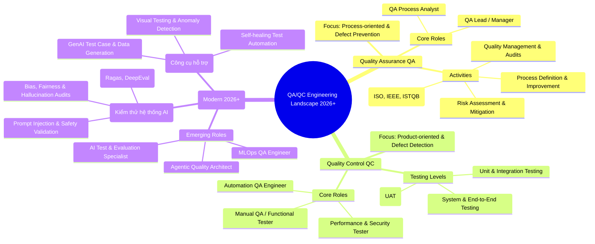

# QA/QC Role Mindmap (Landscape 2026+) - ISTQB & AI-Augmented

**Môn học:** CS423 / CSC13003 – Kiểm thử phần mềm  
**Họ và tên:** Trà Văn Sỹ  
**MSSV:** 23120197  

---

## 1. Sơ đồ Mindmap (Mã Mermaid)

---

## 2. Phản biện 3 Lỗi Sai / Thiếu Sót Của AI Theo Chuẩn ISTQB (CLO G9.1)

1. **Lỗi 1 (Đánh đồng QA và QC):** Ban đầu AI xếp hoạt động *"Test Execution / Bắt lỗi phần mềm"* vào chung nhánh QA.
   * *Đính chính:* Theo chuẩn ISTQB, việc thực thi kiểm thử để tìm lỗi thuộc về **Quality Control (QC)** – mang tính hướng sản phẩm (*Product-oriented / Defect Detection*). Trong khi đó, **Quality Assurance (QA)** là hoạt động mang tính hướng quy trình (*Process-oriented / Defect Prevention*) nhằm ngăn ngừa lỗi ngay từ khâu thiết kế.
2. **Lỗi 2 (Thiếu sự phân tách giữa 'AI for Testing' và 'Testing for AI'):** Ban đầu AI gộp chung tất cả vào một mục mơ hồ là *"AI Testing"*.
   * *Đính chính:* Trong kỷ nguyên 2026+, kiểm thử phần mềm phải tách bạch 2 nhánh:
     * **AI for Testing (AI as a Tool):** Sử dụng các công cụ Generative AI để tự động hóa sinh test case, tạo test data và self-healing script.
     * **Testing for AI (AI as the SUT):** Kiểm thử chính các mô hình AI/LLM/Agent với các chỉ số chuyên biệt (Hallucination, Bias & Fairness, Prompt Injection, Latency, RAG metric).
3. **Lỗi 3 (Bỏ sót vai trò MLOps QA trong kiểm thử liên tục):** Bản phác thảo đầu của AI chỉ liệt kê các vai trò QA truyền thống và LLM Tester, bỏ quên vai trò MLOps QA Engineer.
   * *Đính chính:* Với các hệ thống AI phục vụ sản xuất (Computer Vision, Automotive, Edge AI), vai trò **MLOps QA Engineer** là bắt buộc để xây dựng pipeline đánh giá tự động độ chính xác mô hình (mAP, FPS, latency) và giám sát sự suy thoái dữ liệu (*Data Drift / Model Drift*) trên CI/CD.
